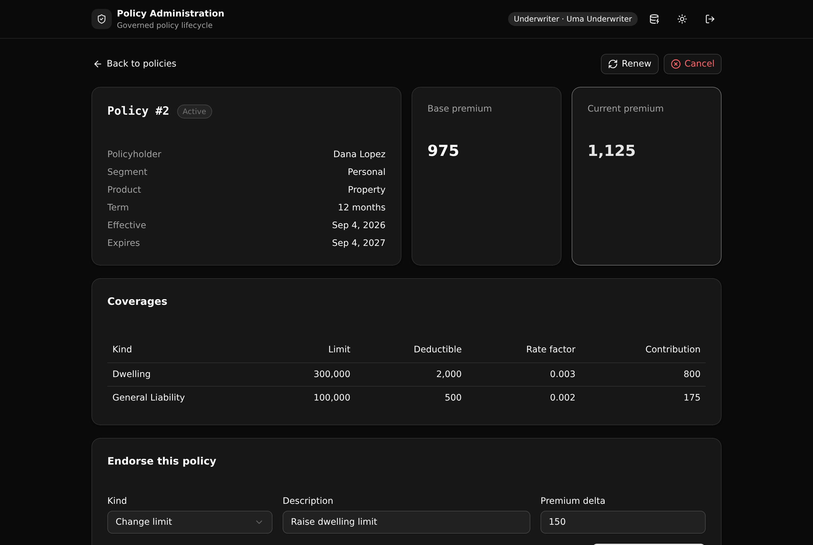

# Policy Administration Service

A governed insurance policy lifecycle in one Xano API layer. Every policy moves through an enforced quote, bind, endorse, renew, and cancel state machine. The premium is recomputed from its coverages on each endorsement, and every change is written to a readable history.



**6 tables · 9 endpoints · 3 API groups.** Backend Modernization play, insurance vertical.

## What it demonstrates

This is the kind of service a legacy admin monolith holds today, rebuilt as one Xano backend a team can read and trust. It shows four things a technical evaluator cares about:

- **A real state machine.** A policy's status moves quoted, bound, active, renewed, cancelled. Illegal moves, like binding a policy that is not quoted or endorsing one that is not active, are refused at the API layer instead of being applied.
- **Derived logic in one place.** The base premium is the sum over a policy's coverages of limit times rate factor, less a small deductible credit. Applying an endorsement recomputes the current premium and records the value before and after.
- **API-layer role-based access control.** An agent can quote. Only an underwriter can bind, endorse, renew, or cancel. A viewer can read. Every protected endpoint re-reads the caller's live role and enforces it, so the rule holds whichever client calls. Access is checked at the API layer, never with row-level security.
- **An append-only audit trail.** Every transition and every premium change writes a `policy_events` row, so the full story of a policy reads in order.

The whole backend lives under [`xano/`](xano/). An evaluator can read it and see exactly what a valid policy change is.

## Repo layout

```
xano/
  tables/         6 tables: users, policyholders, policies, coverages, endorsements, policy_events
  api/            the endpoints, one per file, grouped auth / policy / seed
  api/guards.ts   the shared role checks (API-layer RBAC)
  index.ts        registers every table, group, and query
frontend/
  src/lib/api.ts  the one contract: paths and types derived from the query defs
  src/components  the four screens
docs/             this landing page and the screenshot
```

## API surface

| Verb | Path | What it enforces |
| --- | --- | --- |
| POST | `/api:auth/login` | Checks the password, mints a role-carrying token |
| POST | `/api:policy/quote` | Agent or underwriter, needs at least one coverage, computes the base premium |
| POST | `/api:policy/bind` | Underwriter, only a quoted policy, stamps the term dates |
| POST | `/api:policy/endorse` | Underwriter, only an active policy, recomputes the premium and records old and new |
| POST | `/api:policy/renew` | Underwriter, only an active policy inside its renewal window, rolls the term forward |
| POST | `/api:policy/cancel` | Underwriter, not an already-cancelled policy, records the reason |
| GET | `/api:policy/get/{policy_id}` | Any signed-in role, the policy with its coverages, endorsements, and full history |
| GET | `/api:policy/list` | Any signed-in role, policies with status and premium, filterable by status |
| POST | `/api:seed/run` | Loads the demo book, for the ephemeral only |

Authentication uses native XanoTS primitives: an auth table, `s.security.create_auth_token`, and per-endpoint `s.precondition` role guards. There is no role-level trust in the token alone; each guard re-reads the caller's row.

## Quick start

```bash
git clone https://github.com/xano-scratch/policy-administration-service
cd policy-administration-service
npm install
npx xanots login          # one-time browser sign-in to Xano
npm run xano:deploy       # builds the frontend, deploys to a live ephemeral, prints the URL
```

Open the printed URL and pick a role. The demo book loads on the first sign-in, so you land on a populated policy list. The demo accounts share the password `demo1234`:

- `agent@demo.test` quotes policies
- `underwriter@demo.test` binds, endorses, renews, and cancels
- `viewer@demo.test` reads only

Click **Reset demo data** in the header at any time to reload the book.

## How the premium works

Each coverage contributes its limit times its rate factor, less a small credit for its deductible, floored at zero. The base premium is the sum across a policy's coverages. An endorsement carries a premium delta that moves the current premium, and the move is written to history with the value before and after. The quote screen shows a live estimate as you build it, and the backend computes the value that counts on submit.

## FAQ

**Is the data real?** No. It is seed data for a demo. Treat the deployed environment as a sandbox, not a production system.

**Where is the business logic?** All of it is in `xano/`. The frontend never decides what a valid policy change is. It calls the endpoints and shows the result.

**Can I change the rules?** Yes. Edit the query defs under `xano/api/`, run `npm run xano:deploy`, and the frontend follows, because it reads its paths and types from those same defs.

**Does it need any external service?** No. It runs on seed data with no external credentials.

## License

MIT. See [LICENSE](LICENSE).
